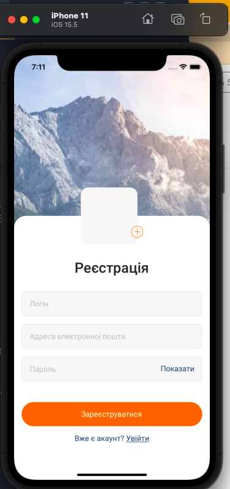
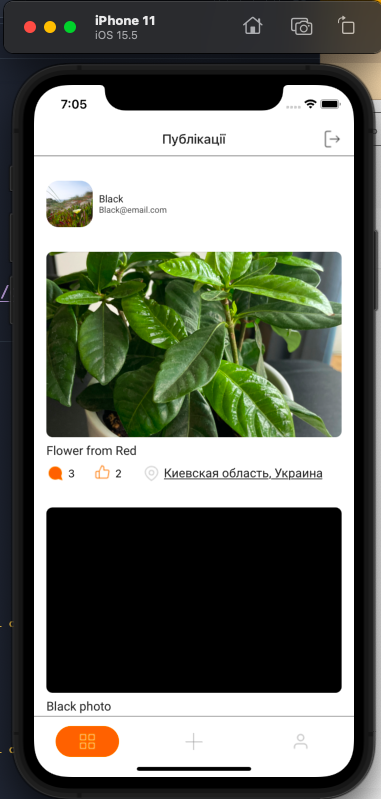
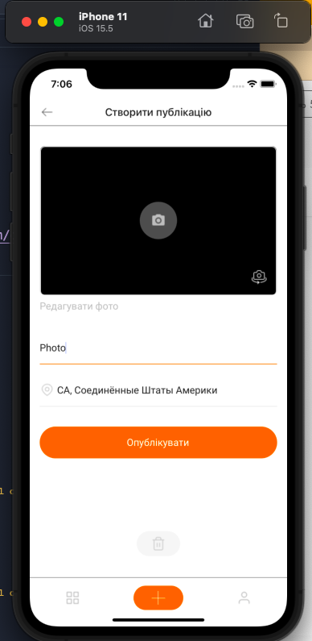
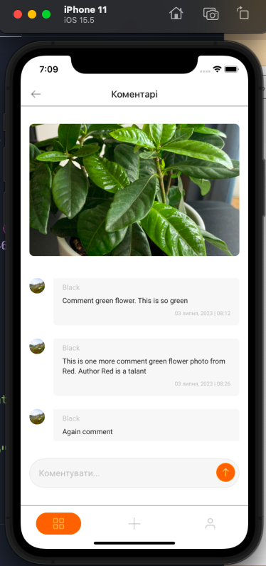

# screens

### Learning task
An application for Android and iOS platforms that allows you to post photos using geolocation, comment them and leave your finger up. Geolocation can be seen on the map. 

The application is closed, requires registration and/or authorization, which allows you to have your own profile with your photos.

Contains two authorization screens (login and password login), main screens: screen of all posts, post creation screen, user profile; nested screens: comments for a specific post and location map screen.

### Layout
[Figma](https://www.figma.com/file/xzW9Q5DXQfqFSk6X5wi8xn/Homework-(Copy)-(Copy)-(Copy)?type=design&node-id=43%3A54&mode=design&t=8GguPqUBaYIKeCgk-1)

### Technical component
1. Library for creating user interfaces: [React](https://uk.legacy.reactjs.org/) and [React Native](https://reactnative.dev/), 
including
-@react-navigation/stack;
-@react-navigation/native;
-@react-navigation/bottom-tabs;
-@react-native-async-storage/async-storage;
-react-native-maps;
-react-native-screens;

2. Development tool: [Expo](https://docs.expo.dev/), 
including 
-@expo-google-fonts;
-expo-camera;
-expo-image-picker;
-expo-location;
-expo-status-bar;

3. Auth, User data save: [Firebase](https://firebase.google.com/docs/)
 and
-@reduxjs/toolkit;
-react-redux;
-redux-persist;

4. Deploy to expo server: [Expo-dev-client](https://docs.expo.dev/eas-update/expo-dev-client/)
My link at the expo server (valid until 01.08.2023): 
[Android internal distribution build](https://expo.dev/accounts/khavrat/projects/Screens/builds/96d8c22f-6a47-46f1-ad52-4a9a1a8d2cb5)

Some screenshots app:

